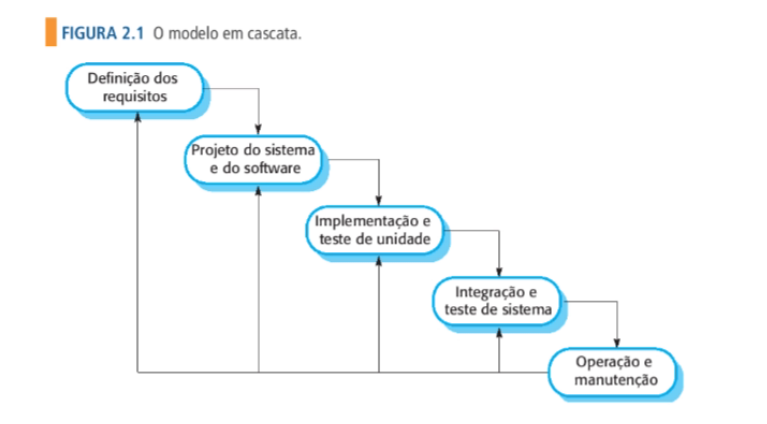

# Modelo em cascata
O modelo cascata é o primeiro modelo de processo de desenvolvimento de software e foi inspirado nos modelos utilizados na engenharia de grandes sistemas militares.
Esse modelo é como uma série de estágios, devido a cascata de uma fase para outra, ele é conhecido como modelo em cascata. É um exemplo de modelo dirigido por plano 
e é necessário planejar e criar um cronograma de todas as atividades do processo antes de começar o desenvolvimento.

