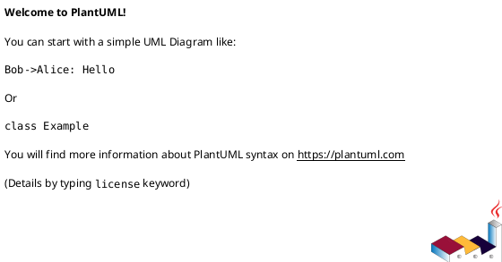

# Título do Tema

> 💡 **Resumo em uma linha**: o que esse tema representa no contexto geral.

---

## Contexto

Onde esse tema se encaixa na Engenharia de Software? Por que ele importa?
Escreva 2-4 linhas conectando com o que você já sabe.

---

## Conceitos Principais

### Conceito A

Explicação com suas próprias palavras. Evite copiar do livro — reformule.

### Conceito B

Explicação...

> 📌 **Citação ou definição formal** (Sommerville, 2011, p. XX)

---

## Diagrama / Ilustração

Ou uma imagem:

---

## Exemplo Prático

Um caso concreto, preferencialmente algo do dia a dia ou de um exercício da aula.

---

## Conexões com outros temas

- Relaciona com [[elicitacao]] porque...
- Ver também: [Diagramas de Caso de Uso](../03-uml-e-modelagem/diagramas-de-caso-de-uso.md)

---

## Exercícios / Questões

1. Pergunta ou exercício resolvido
2. ...

---

## Referências

- SOMMERVILLE, Ian. *Engenharia de Software*. 9. ed. Cap. X, p. XX.
- BEZERRA, Eduardo. *Princípios de Análise e Projeto de Sistemas com UML*. p. XX.